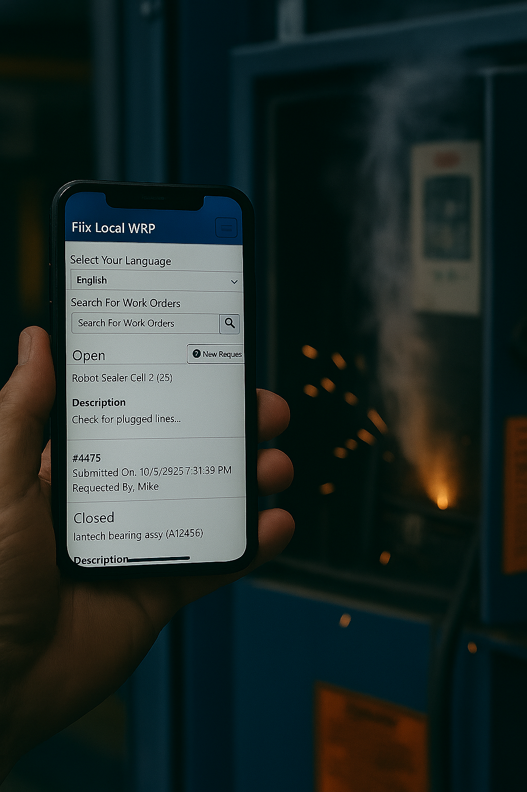

# Fiix Local Work Request Portal (WRP)

  

## Overview

**Fiix Local WRP** is a Blazor-based web application designed to replace the existing Fiix Work Request Portal for organizations that require a self-hosted solution on their internal networks. This app ensures all data and access remain behind your firewall, leveraging your existing security infrastructure.

A key feature is real-time language translation for all content, powered by Azure Cognitive Services, enabling seamless multilingual support for users.

---

## Features

- **Self-hosted**: Deploy on-premises, fully under your IT team's control.
- **Secure**: Runs behind your firewall; only outbound connections required are:
  - Port 443 to your Fiix tenant address
  - Outbound URL to Azure Cognitive Services for translation
- **Real-time language translation**: All UI content is translated instantly using Azure Translation services.
- **Modern UI**: Built with Blazor (.NET 9, C# 13), providing a responsive and interactive experience.
- **Easy deployment**: Can be run as a standalone executable or hosted via IIS.

---

## Screenshots

<!-- Add screenshots of the app UI here -->

---

## Getting Started

### Prerequisites

- [.NET 9 SDK](https://dotnet.microsoft.com/download/dotnet/9.0)
- Access to Azure Cognitive Services (for translation)
- Windows Server (for IIS deployment, optional)

### Downloading the Source

Clone the repository:

Open the solution in Visual Studio 2022.

---

## Compiling and Running

### Self-Hosting (Standalone Executable)

1. Build the project in Visual Studio (`Release` or `Debug`).
2. Navigate to the output directory (e.g., `bin\Release\net9.0`).
3. Run the executable:

The app will start and be accessible on the configured port (default is 5000 for HTTP or 443 for HTTPS if configured).

### Running with `dotnet`

Alternatively, you can run the app using the .NET CLI:

This allows hosting on other platforms that support .NET 9.

---

## IIS Deployment Guide (Windows Server)

1. **Publish the App:**
   - In Visual Studio, right-click the project and select `Publish`.
   - Choose `Folder` as the target and publish to a local directory.

2. **Configure IIS:**
   - Open IIS Manager.
   - Add a new site, pointing the physical path to your published folder.
   - Set the binding to your desired port (typically 443 for HTTPS).
   - Ensure the Application Pool is set to `.NET CLR Version: No Managed Code` and pipeline mode is `Integrated`.

3. **Permissions:**
   - Grant the IIS AppPool user read/execute permissions on the published folder.

4. **Firewall & Network:**
   - Ensure only outbound connections to your Fiix tenant (port 443) and Azure Cognitive Services are allowed.

5. **Start the Site:**
   - Start the site in IIS Manager and verify access from your internal network.

---

## Configuration

- **Azure Cognitive Services**: Set your API key and endpoint in the app settings.
- **Fiix Tenant Address**: Configure the target Fiix URL in the app settings.

---

## Security Notes

- All access is managed by your IT team.
- No inbound ports need to be opened except for user access.
- Outbound connections are limited to Fiix and Azure Translation endpoints.

---

## License

Use at your own risk.  No Warrently of any kind. 

---

## Contact

For support or questions, please contact [Mike-D-Cooper](https://github.com/Mike-D-Cooper).
